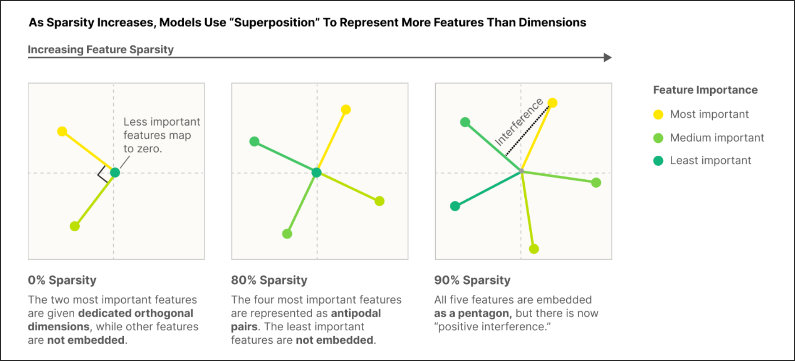

# Coming up with the idea

This past summer I became pretty interested in mechanistic interpretability, and naturally I started learning about it through Neel Nanda's blogs and the ARENA 3.0 exercises I found on GitHub. To actually apply what I was learning and explore current frontier research, I came up with two mini-projects. The first (the subject of this blog) is *"Comparing Steering Methods: Difference-of-Means vs Naive SAE vs Steelman SAE."* The second is *"Circuit Tracers"* (currently in progress).

For the layman, your first question is probably what these obscure names mean. I'll clear all that up in the methodology section.

So how did I come up with the topic? I got really interested in steering and SAEs while working through the ARENA exercises, and I decided to look up the actual research. I chanced upon a debate about steering with the baseline method (difference-of-means) versus SAEs. The SAE skeptics ran an experiment comparing the two and found the baseline clearly beating the SAE on every measure. A later paper from SAE defenders argued that the SAEs simply weren't being steered the right way, and with a better applied ("steelman") SAE, it matched and sometimes outperformed the baseline. I thought: why not represent both stances in a single notebook? And that's how this project came about.

> Note: "steelman" is a term I borrowed. It's the opposite of a "strawman", and it just means giving the opposing side its strongest possible form before testing it.

As for choosing "world cup" as the concept to steer on: I came across Anthropic's Golden Gate Claude and wanted to do something similar. Since the World Cup had just concluded, it felt like the obvious choice. All I had to do was find which layer contained a clean World Cup latent in the `gpt2-small-res-jb` SAEs. Layer 6, index 7392 was the first clean one I found, so I went with it.


# The Methodology

Some basic definitions first (skip these if you already know them).

::: {.callout-note collapse="true"}
## What is difference-of-means, and why is it called the baseline?
Difference-of-means is a *supervised* feature vector obtained by taking the difference between the mean activations of a positive set and a neutral set. It represents the actual "world cup" direction in the model. If I want to increase the "world cup-ness" of the model's answers, I add this vector to the internals (by intervening through hooks); if I want to decrease it, I subtract the direction. It's called the baseline because it's the simple, cheap method the fancier SAE approaches are compared against.
:::

::: {.callout-note collapse="true"}
## What are hooks?
Hooks are a fundamental concept in mechanistic interpretability, introduced in the `transformer_lens` library (by Neel Nanda), the most widely used library for this kind of work. The library defines named checkpoints throughout the model's internals that a hook can access. A hook is a function of the form `hook_fn(resid, hook)` that either *reads* the internals or *intervenes* on them. (The `hook` argument is a HookPoint object carrying info like `name`, `layer()`, and `ctx` (context).)

Under the hood, a block roughly looks like this, where each `hook_*` is a checkpoint you can attach to:

```python
x = self.hook_resid_pre(x)     # a HookPoint, named "blocks.6.hook_resid_pre"
x = x + attn(x)
x = self.hook_resid_mid(x)
x = x + mlp(x)
x = self.hook_resid_post(x)
```
:::

Before I explain sparse autoencoders, there's a concept called **superposition** that should be understood first.

::: {.callout-note collapse="true"}
## What is superposition?
It has been experimentally observed that when feature activations are sparse, neurons can represent more features than they have dimensions. Feature directions would ideally be orthogonal, but under superposition they are only *nearly* orthogonal (almost 90 degrees apart), which allows a single neuron to be polysemantic, encoding several features at once.


:::

::: {.callout-note collapse="true"}
## What is sparsity?
Sparsity means only a small number of the SAE's features are active (non-zero) for any given input. Each input is explained by a *few* features, not all of them.
:::

::: {.callout-note collapse="true"}
## What are SAEs?
SAEs (sparse autoencoders) are devices that promote monosemanticity. They are over-complete dictionaries whose dimension is larger than the activation dimension, so that every individual feature packed into a neuron can get its own direction. They are trained to reconstruct the input from the same features they extract, penalized by a sparsity term.

```
x                -> (batch, seq, d_model)
feats            = ReLU(x @ sae.W_enc)      # (b, s, d_model) @ (d_model, d_sae); d_sae > d_model
x_reconstruction = feats @ sae.W_dec
error            = x - x_reconstruction

loss = ||x - x_reconstruction||^2   +   lambda * ||feats||_1
       |___ reconstruction (MSE) ___|     |___ sparsity (L1) ___|
```

Without the sparsity penalty, the SAE could just use all its features densely, no better than the neuron it's decoding. The L1 penalty forces the SAE to explain each input with a *minimal* set of active features, so each feature specializes in one interpretable concept. **Sparsity is what buys monosemanticity.**
:::

First I set up the statements used for training the difference-of-means vector and for evaluating the SAEs on the steering metrics. The statements were split into two categories: a positive set and a neutral set. I wrote 20 statements for each and asked Claude to extend them to a reasonable size (50 each). Then I wrote the baseline (difference-of-means), which computes the difference between the mean positive activations and the mean neutral activations. The norm of this vector came out to be **15.1288**.

```python
def diff_of_means(model, statements, hook_name):
    pos_acts     = t.empty(len(pos_list), model.cfg.d_model).to(device)
    neutral_acts = t.empty(len(neutral_list), model.cfg.d_model).to(device)
    for i in range(len(statements)):
        _, cache = model.run_with_cache(statements[i])
        if i < len(pos_list):
            pos_acts[i] = cache[hook_name][0, -1]
        else:
            neutral_acts[i - len(pos_list)] = cache[hook_name][0, -1]
    return pos_acts.mean(0) - neutral_acts.mean(0)
```

Second, I defined a general steering hook to intervene on the model's internals. It returns different values depending on whether a `steering_vector` (the difference-of-means vector) is supplied. When it is supplied, the vector's norm is **15.1288**; when it isn't, the vector used is `sae.W_dec[latent_idx]` (the Naive SAE case), whose norm is **~1**. This norm disparity is what I later use to choose sensible steering coefficients for each case, since the same coefficient means very different push strengths for a norm-15 vector versus a norm-1 vector, so each method has to be swept over its own coefficient range.

```python
def steering_hook(acts, hook, sae, latent_idx, steering_vector=None, steering_coefficient=1.0):
    if steering_vector is not None:                     # difference-of-means case
        return acts + steering_coefficient * steering_vector
    else:                                               # naive SAE case
        return acts + steering_coefficient * sae.W_dec[latent_idx]
```

This steering hook is applied through `fwd_hooks`, which intervenes at the given hook name and substitutes whatever the hook returns. For generation I set `temperature = 0.7` to balance coherence and diversity, and `freq_penalty = 1.0`.

## Effect and Perplexity

Now the two steering metrics: **effect** and **perplexity** (coherence). These are the two axes of the graph I plot at the end. For effect I first defined a keyword list related to the World Cup.

```python
keywords_set = set(['world', 'cup', 'tournament', 'soccer', 'football', 'qualify',
    'qualification', 'knockout', 'match', 'goal', 'striker', 'score', 'championship',
    'players', 'fifa', 'team', 'qualifier', 'qualifying', 'finals', 'knockouts'])
```

The **effect** metric counts the frequency of these keywords in the generated output; higher frequency means stronger steering. The counts are normalized by the length of the output, so it's really a keyword *density*.

The **perplexity** (coherence) metric captures, roughly, how many words the model is choosing between at each step. Higher perplexity means lower coherence (the model is more "confused"), which tends to produce incoherent text. In short, it measures whether the output is gibberish or a grammatically correct, human-readable sentence. You might ask: computing effect is easy, but how do you compute the perplexity of the outputs? It's actually quite intuitive.

To evaluate the SAE and the baseline, I wrote a set of fresh neutral prompts (held out from the training statements).

```python
eval_neut_statements = [
    "She goes to the gym every day.", "I like drinking tea in the morning.",
    "My neighbour seems friendly.", "My cousin used to play chess.",
    "The lights here are dim.", "He opened the window and looked out.",
    # ... 25 held-out neutral prompts in total
]
```

The **effect** metric is straightforward: convert the output string to a list of words and compare them against the keyword set. I used `re.findall('[a-z]+', output.lower())` rather than `output.lower().split()`, because `split()` doesn't separate punctuation from words.

```python
tokens = re.findall('[a-z]+', output.lower())
effect = sum(tok in keywords_set for tok in tokens) / len(tokens)   # keyword density
```

For **perplexity**, I run the generated output back through the *original* (unsteered) model and compute its loss. The loss measures how well the clean model predicts each next token of the generated text; low loss means the text is predictable (coherent) to the model. Perplexity is just the exponentiation of that loss, so lower loss means lower perplexity. I then swept over different steering coefficients and built a dictionary of both metrics.

```python
def perplexity(model, prompt):
    loss = model(prompt, return_type="loss")   # clean model, no steering hook
    return t.exp(loss).item()
```

This is just baseline vs Naive SAE for now. After plotting these two, it was clear the Naive SAE was no match for difference-of-means. To give the baseline some real competition, I introduced the Steelman SAE.

## Steelman SAE

I coined "steelman" as the opposite of the "strawman" naive SAE, it's not an official term. `W_enc` is the weight responsible for feature *extraction* in an SAE, so intuitively, directly changing the *encoded value* of a specific latent should steer the model more precisely than blindly adding its decoder direction. That's exactly what the steelman approach does.

The clamping idea was introduced in Golden Gate Claude by Anthropic: they set the encoding at a specific `latent_idx` to a target value. I ran two variations for the steelman SAE, one with constant targets and one with decaying ones. Targets are values which are about 1.5 to 2 times the max_activation of the latent.

::: {.callout-note collapse="true"}
## What is max activation?
Max activation is the largest value the encoding takes across tokens for that particular `latent_idx`.
:::

For my model the max activation is **26.579**, computed as shown below.

```python
def max_activation(model, sae, hook_name, latent_idx, pos_list):
    max_list = []
    for s in pos_list:
        _, cache = model.run_with_cache(s)
        feats = sae.encode(cache[hook_name])
        max_list.append(feats[..., latent_idx].max().item())
    return max(max_list)
```

For both variants I clamp the encodings (`feats`) at the chosen latent to a target value. In the decaying variant the target is scaled down as the token position grows. Then, exactly as before, I compute effect and perplexity, except this time I sweep over target values (from 0 to 8 times the max activation) instead of steering coefficients. For the decay rate I found that an aggressive rate of 0.9 faded the steering almost to zero within the first fifteen generated tokens, so the outputs stayed coherent but drifted off topic. A gentler rate of 0.98 kept the steering alive across the whole generation, so that is the rate I used.

The two hooks are below. Note the error term is computed *before* the clamp, so that only the clamp changes the residual:

```python
def steelman_hook(acts, hook, sae, latent_idx, target):          # constant clamp
    feats = sae.encode(acts)
    error = acts - sae.decode(feats)
    feats[..., latent_idx] = target
    return sae.decode(feats) + error

def steelman_hook_decay(acts, hook, sae, latent_idx, prompt_len, target, rate=0.98):
    feats = sae.encode(acts)
    error = acts - sae.decode(feats)
    pos = t.arange(feats.shape[1], device=device)
    offset = (pos - prompt_len).clamp(min=0.0)                    # decay from generation start
    schedule = t.where(pos >= prompt_len, target * (rate**offset), 0.0)
    feats[..., latent_idx] = schedule
    return sae.decode(feats) + error
```

For generation in the steelman experiments I set `temperature = 0.7`, `freq_penalty = 1.0`, and `use_past_kv_cache = False`. The KV cache is an optimization that stores the key and value vectors of past tokens, so the model only has to process the single newest token at each generation step. That is normally faster, but it means every forward pass sees a sequence of length one, so a decay schedule that indexes by position within the current pass would always land on position zero and never actually decay. Turning the cache off makes each step reprocess the whole sequence so far, so the position index grows and the decay applies across the generated tokens as intended. The tradeoff is slower generation.

Finally I plotted all four methods together: difference-of-means, naive SAE, steelman with a constant target, and steelman with a decaying target. To keep the comparison fair I swept each method over its own range until all of them reached comparable perplexities, so that no method is pushed harder than the others.

```{=html}
<iframe src="images/frontier.html" width="100%" height="520" style="border:none;"></iframe>
```

*The steering frontier: World Cup effect (higher is stronger) versus perplexity (lower is more coherent), for all four methods. The naive SAE stays flat at the bottom. Difference-of-means and the decaying steelman track each other; the constant steelman only pulls ahead in the high-perplexity region where the text is already breaking down.*

# Observation

The naive SAE is not competitive. It stays flat near zero effect across every perplexity, so it loses on both axes.

The interesting result is the other three. Difference-of-means and the steelman with decay track each other almost the whole way, so they are effectively tied across the coherent range. The steelman with a constant target only pulls ahead at high perplexity, which is the region where the text is already breaking down, so that edge comes at the cost of coherence. The decaying steelman at rate 0.98 behaves almost identically to the constant one, which tells me the useful window for decay is narrow. Too gentle and it matches the constant clamp, too aggressive (rate 0.9) and the steering fades away entirely.

At matched perplexity the three steering methods produce comparable World Cup text. All three steer the same neutral prompt, *"She goes to the gym every day."*, into recognizable World Cup text:

> **Difference-of-means:** "...she's not going to be playing in the Olympic training camp in Brazil, or qualifying for the 2014 World Cup in Russia, or any other international."

> **Steelman (constant):** "...this year, in her first tournament, she will be unable to finish any spells against Wales and Portugal at home... ready when England kicks off."

> **Steelman (decay):** "...she was wiped out by Spain in 2007... she made it back on her feet after being ruled out for five years by England's first-choice squad."

And here is what happens when any method is pushed hard, where the output degrades into repeated football jargon:

> **Steelman (constant), high target:** "...they are being not qualifiers in qualification for, qualifying for, supported team qualifiers. In Brazil and qualifying for... a more local qualifier in 2022."

This motivates the limitation below.

# Limitations

Because both the evaluation and training datasets are very small, I can't *prove* that the Steelman SAE and difference-of-means are on par; I can only *suggest* it based on this experiment. A larger evaluation set with error bars would be needed to establish whether the apparent tie is real or just noise.

When I visually inspected the outputs, I noticed that the keyword set rewards repetition. Words like qualifier and qualifying show up over and over at high steering strengths, which inflates the effect metric. Importantly this happens for every method: both the steelman and the difference-of-means baseline degrade into the same repeated jargon when pushed hard, so the bias is symmetric and does not favour one side of the comparison. It does mean the absolute effect numbers are overstated. An independent, non keyword effect metric such as an LLM judge would be more robust.

This is also a single case study: one model (GPT-2 small), one concept (World Cup), one latent (7392). It shouldn't be read as a general verdict on SAEs versus baselines.

# Conclusion

Neither the Steelman SAE nor the difference-of-means baseline clearly wins. But the baseline has the edge on sheer simplicity, which tilts the verdict toward the skeptics. This echoes a broader 2025 finding: use SAEs to *discover* unknown concepts, not to *act on* concepts you already know (Wu et al., arXiv:2506.23845). When you already know the direction you want to push, a simple supervised vector is hard to beat.

**Future work:** (1) a larger evaluation set with error bars, to test whether the tie survives noise; (2) multiple concepts, models, and latents, to see how far the result generalizes; (3) an independent, non-keyword effect metric (e.g. an LLM judge) to remove the repetition bias; (4) sweeping the decay rate of the steelman clamp.

# References

- Anthropic, *Scaling Monosemanticity / Golden Gate Claude* (2024): feature clamping.
- *SAEs Are Good for Steering, If You Select the Right Features*, arXiv:2505.20063.
- *A Comparative Analysis of Sparse Autoencoder and Activation Difference in Language Model Steering*, arXiv:2510.01246 (token-wise decaying steering).
- Kantamneni et al., *SAE probes underperform simple baselines*, arXiv:2502.16681.
- Wu et al., *Use Sparse Autoencoders to Discover Unknown Concepts, Not to Act on Known Concepts*, arXiv:2506.23845.
